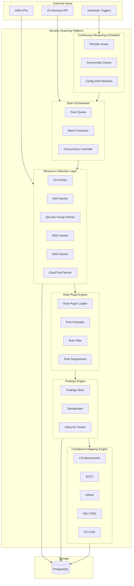
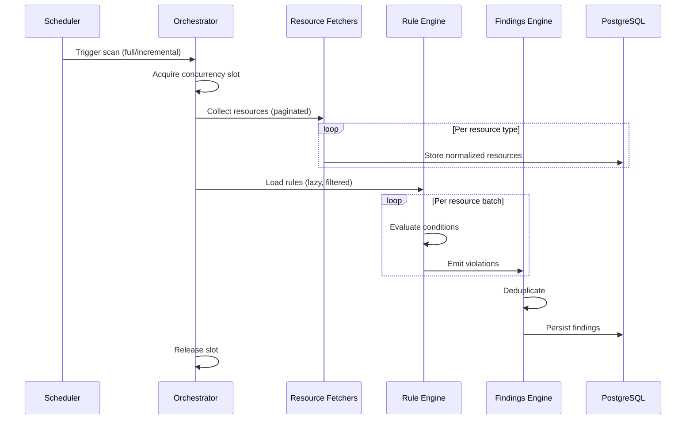
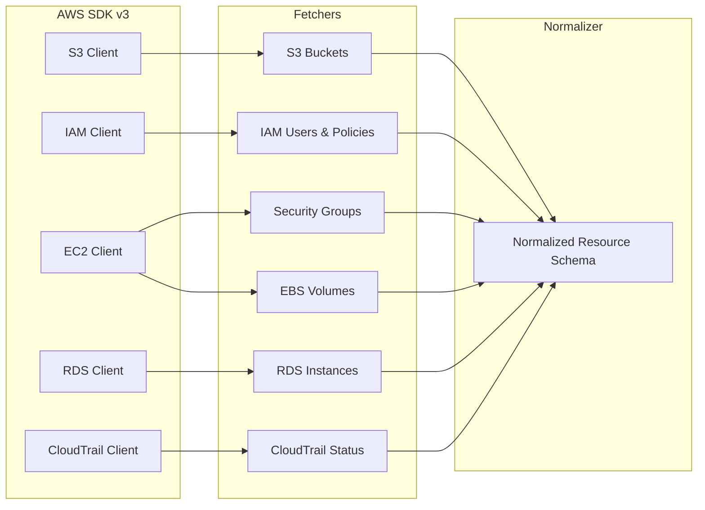
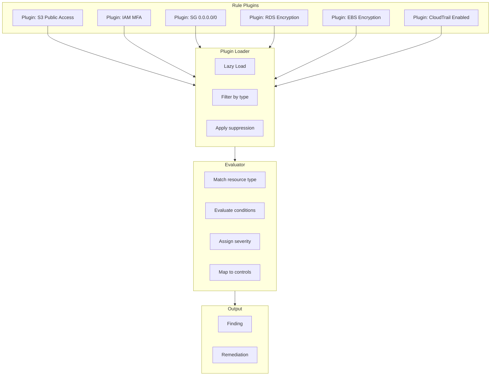
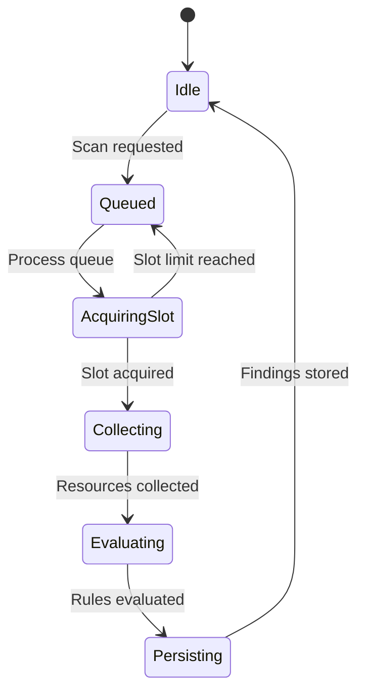
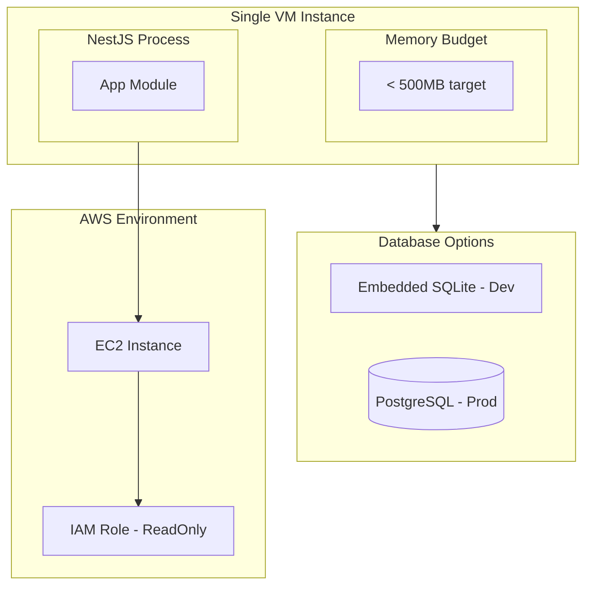

# Unified Security Scanning Platform — Architecture Diagram

> **Deployment Target:** AWS Marketplace AMI | Self-hosted VM  
> **Architecture:** Modular Monolith (NestJS)  
> **Performance Targets:** <500MB RAM | Boot <10s

---

## High-Level System Architecture

---

## Component Interaction Flow

---

## Resource Collection Layer (Cloud Fetchers)

---

## Rule Plugin Engine Architecture

---

## Scan Orchestration Flow

---

## Deployment Topology (VM / AMI)

---

## Performance Optimization Points

| Layer | Optimization |
|-------|--------------|
| **Fetchers** | Pagination, minimal fields, batch writes |
| **Rules** | Lazy load, filter by resource type, stream evaluation |
| **Orchestrator** | Concurrency limit, batch size control |
| **Findings** | Upsert dedup, indexed queries |
| **Scheduler** | Lightweight cron, no heavy job queue |
