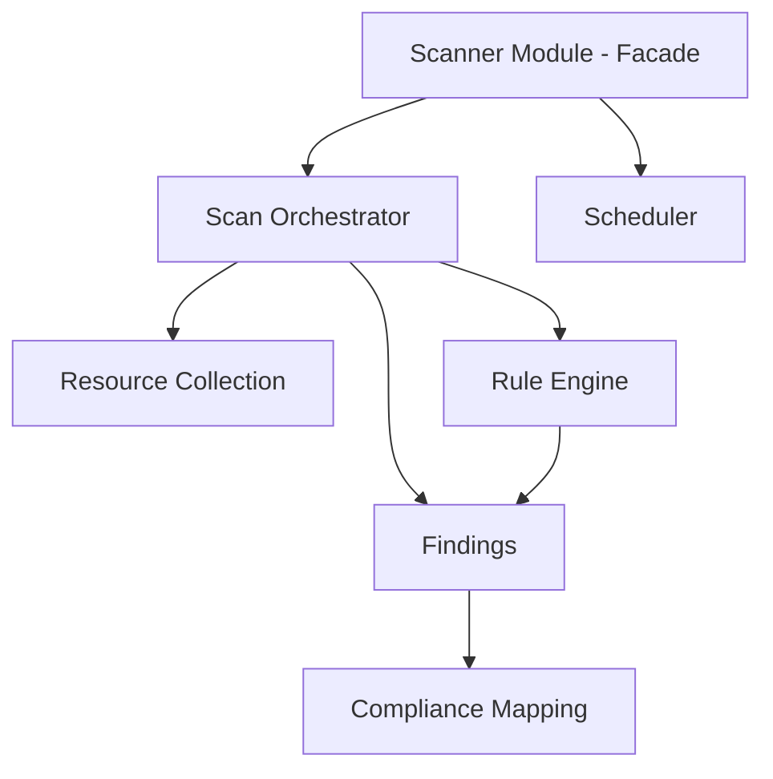

# Unified Security Scanning Platform — Module Structure

> **Pattern:** NestJS Modular Monolith  
> **Principle:** High cohesion within modules, loose coupling between modules

---

## Directory Tree

```
appliance-backend/
├── src/
│   ├── main.ts
│   ├── app.module.ts
│   │
│   ├── shared/                          # Cross-cutting utilities
│   │   ├── prisma.service.ts
│   │   └── pagination.util.ts
│   │
│   ├── modules/
│   │   │
│   │   ├── resource-collection/         # 1️⃣ Resource Collection Layer
│   │   │   ├── resource-collection.module.ts
│   │   │   ├── resource-collection.service.ts
│   │   │   ├── interfaces/
│   │   │   │   ├── fetcher.interface.ts
│   │   │   │   └── normalized-resource.interface.ts
│   │   │   └── fetchers/
│   │   │       ├── base.fetcher.ts
│   │   │       ├── s3.fetcher.ts
│   │   │       ├── iam.fetcher.ts
│   │   │       ├── security-group.fetcher.ts
│   │   │       ├── rds.fetcher.ts
│   │   │       ├── ebs.fetcher.ts
│   │   │       └── cloudtrail.fetcher.ts
│   │   │
│   │   ├── rule-engine/                 # 2️⃣ Rule Plugin Engine
│   │   │   ├── rule-engine.module.ts
│   │   │   ├── rule-engine.service.ts
│   │   │   ├── plugin-loader.service.ts
│   │   │   ├── rule-evaluator.service.ts
│   │   │   ├── interfaces/
│   │   │   │   ├── rule.interface.ts
│   │   │   │   └── rule-plugin.interface.ts
│   │   │   └── plugins/                 # Lazy-loaded rule definitions
│   │   │       ├── s3/
│   │   │       │   ├── s3-public-access.rule.ts
│   │   │       │   └── s3-encryption.rule.ts
│   │   │       ├── iam/
│   │   │       │   └── iam-mfa.rule.ts
│   │   │       ├── security-group/
│   │   │       │   └── sg-public-ingress.rule.ts
│   │   │       ├── rds/
│   │   │       │   └── rds-encryption.rule.ts
│   │   │       ├── ebs/
│   │   │       │   └── ebs-encryption.rule.ts
│   │   │       └── cloudtrail/
│   │   │           └── cloudtrail-enabled.rule.ts
│   │   │
│   │   ├── scan-orchestrator/           # 3️⃣ Scan Orchestrator
│   │   │   ├── scan-orchestrator.module.ts
│   │   │   ├── scan-orchestrator.service.ts
│   │   │   ├── scan-queue.service.ts
│   │   │   ├── batch-processor.service.ts
│   │   │   └── interfaces/
│   │   │       ├── scan-job.interface.ts
│   │   │       └── scan-config.interface.ts
│   │   │
│   │   ├── findings/                    # 4️⃣ Findings Engine
│   │   │   ├── findings.module.ts
│   │   │   ├── findings.service.ts
│   │   │   ├── deduplication.service.ts
│   │   │   ├── lifecycle.service.ts
│   │   │   └── interfaces/
│   │   │       └── finding.interface.ts
│   │   │
│   │   ├── compliance-mapping/           # 5️⃣ Compliance Mapping Engine
│   │   │   ├── compliance-mapping.module.ts
│   │   │   ├── compliance-mapping.service.ts
│   │   │   └── frameworks/
│   │   │       ├── cis.benchmark.ts
│   │   │       ├── soc2.ts
│   │   │       ├── hipaa.ts
│   │   │       ├── iso27001.ts
│   │   │       └── pci-dss.ts
│   │   │
│   │   ├── scheduler/                   # 6️⃣ Continuous Monitoring Scheduler
│   │   │   ├── scheduler.module.ts
│   │   │   ├── scheduler.service.ts
│   │   │   └── drift-detection.service.ts
│   │   │
│   │   ├── scanner/                     # Facade: wires all above
│   │   │   ├── scanner.module.ts
│   │   │   ├── scanner.controller.ts
│   │   │   ├── scanner.service.ts
│   │   │   └── interfaces/
│   │   │       └── index.ts
│   │   │
│   │   ├── asset/                       # Existing
│   │   ├── compliance/                  # Existing
│   │   ├── control-engine/              # Existing
│   │   ├── evidence/                    # Existing
│   │   ├── risk/                        # Existing
│   │   ├── audit/                       # Existing
│   │   ├── monitoring/                  # Existing
│   │   └── logging/                    # Existing
│   │
│   └── health.controller.ts
│
├── prisma/
│   └── schema.prisma
├── package.json
└── tsconfig.json
```

---

## Module Dependency Graph



---

## Module Responsibilities

| Module | Responsibility | Key Exports |
|--------|----------------|-------------|
| **resource-collection** | Connect to AWS, fetch resources, normalize, store | `ResourceCollectionService`, `*Fetcher` |
| **rule-engine** | Load rules, evaluate against resources, emit violations | `RuleEngineService`, `PluginLoaderService` |
| **scan-orchestrator** | Coordinate scans, queue, batch, concurrency | `ScanOrchestratorService`, `ScanQueueService` |
| **findings** | Store, deduplicate, track lifecycle | `FindingsService`, `DeduplicationService` |
| **compliance-mapping** | Map findings → CIS, SOC2, HIPAA, ISO, PCI | `ComplianceMappingService` |
| **scheduler** | Periodic scans, incremental, drift detection | `SchedulerService` |
| **scanner** | Facade: API + orchestration wiring | `ScannerController`, `ScannerService` |

---

## Fetcher Interface Contract

```typescript
// fetcher.interface.ts
export interface IResourceFetcher {
  readonly resourceType: string;
  fetch(region: string, options?: FetchOptions): AsyncGenerator<NormalizedResource>;
}
```

Each fetcher:
- Uses AWS SDK v3
- Implements pagination
- Returns minimal normalized fields
- Yields resources (streaming, no full load)

---

## Rule Plugin Interface Contract

```typescript
// rule-plugin.interface.ts
export interface IRulePlugin {
  readonly code: string;
  readonly resourceType: string;
  readonly severity: Severity;
  readonly controlIds: string[];
  readonly remediation: string;
  evaluate(resource: NormalizedResource): RuleResult;
}
```

---

## Import Strategy

- **Scanner** imports: Orchestrator, Scheduler
- **Orchestrator** imports: ResourceCollection, RuleEngine, Findings
- **RuleEngine** imports: Findings (to emit)
- **Findings** imports: ComplianceMapping (to enrich)
- **Scheduler** imports: Orchestrator (to trigger)

No circular dependencies. All modules use `PrismaService` via DI.
