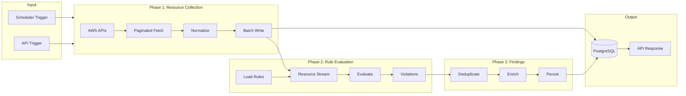
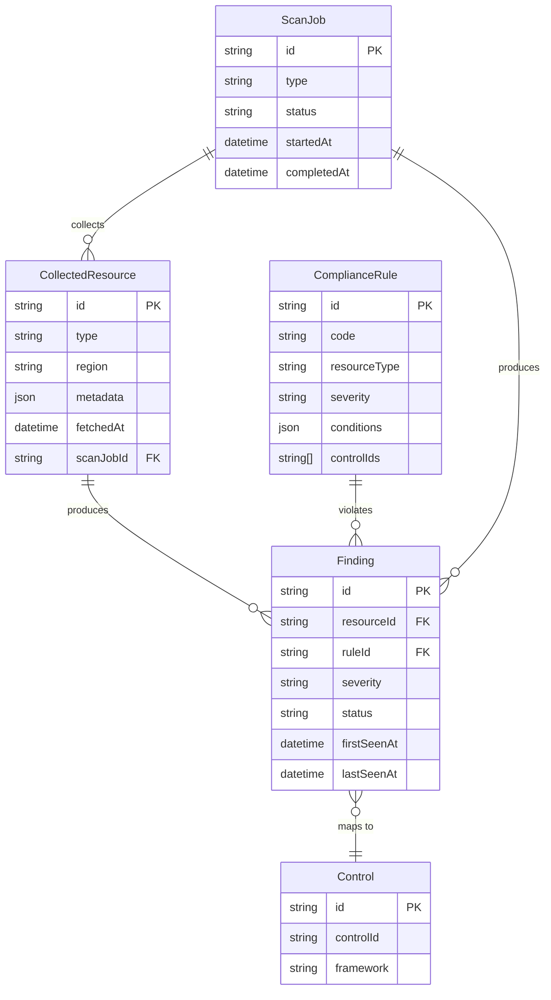

# Unified Security Scanning Platform — Data Flow Design

> **Principle:** Stream-oriented, batch processing, minimal in-memory retention

---

## End-to-End Data Flow



---

## Phase 1: Resource Collection Flow

### Data Sources → Normalized Schema

| AWS API | Fetcher | Key Fields Stored | Pagination |
|---------|---------|-------------------|------------|
| S3 ListBuckets + GetBucket* | S3Fetcher | name, publicAccessBlock, versioning, encryption | ListBuckets (1000), no pagination for bucket attrs |
| IAM ListUsers + GetUser | IamFetcher | userName, mfaActive, accessKeysCount | ListUsers (100) |
| EC2 DescribeSecurityGroups | SecurityGroupFetcher | groupId, groupName, vpcId, rule counts | NextToken |
| RDS DescribeDBInstances | RdsFetcher | instanceId, engine, publiclyAccessible, storageEncrypted | Marker |
| EC2 DescribeVolumes | EbsFetcher | volumeId, encrypted, state | NextToken |
| CloudTrail DescribeTrails | CloudTrailFetcher | trailName, multiRegion, logFileValidation | N/A |

### Normalization Rules

1. **Flatten** nested structures; store only evaluation-relevant fields
2. **Omit** large blobs (e.g., policy documents stored separately if needed)
3. **Standardize** `id`, `type`, `region`, `accountId`, `fetchedAt` on all resources
4. **Batch write** every N resources (e.g., 50) to avoid transaction bloat

### Memory Budget

- Per-fetcher: ~1–5MB working set
- No full-region load: process page-by-page, write, release

---

## Phase 2: Rule Evaluation Flow

### Rule Loading (Lazy)

```
Scan starts
  → Orchestrator requests rules for resource type "s3"
  → PluginLoader loads only s3/*.rule.ts (or DB rules for s3)
  → Rules cached for duration of scan
  → Next resource type "iam" → load iam rules
```

### Evaluation Pipeline

```
For each resource (streamed):
  1. Filter rules: resourceType === resource.type
  2. For each rule:
     a. Evaluate conditions (AND)
     b. If FAIL → emit { resourceId, ruleCode, severity, message, controlIds }
  3. Batch violations (e.g., 20) → send to Findings
```

### Condition Evaluation

- **Path-based**: `resource.publicAccessBlock` → exists? eq?
- **Operators**: eq, neq, exists, not_exists, in, not_in, gt, gte, lt, lte
- **Short-circuit**: stop on first failing condition

---

## Phase 3: Findings Flow

### Deduplication

- **Key**: `(resourceId, ruleId)` — unique per resource+rule
- **Strategy**: Upsert
  - If exists: update `lastSeenAt`, keep `firstSeenAt`
  - If new: insert
- **Status**: open | acknowledged | resolved | suppressed

### Lifecycle

```
New violation    → status: open
User acknowledges → status: acknowledged
User fixes       → next scan: no violation → status: resolved (or auto-resolve)
User suppresses  → status: suppressed (rule/suppression engine skips)
```

### Compliance Enrichment

- Each finding has `controlIds: string[]`
- ComplianceMappingService resolves: controlId → framework, control name
- Stored in finding or computed on read

---

## Scan Types & Triggers

| Scan Type | Trigger | Scope | Frequency |
|-----------|---------|-------|-----------|
| **Full** | Scheduler (cron) | All regions, all resource types | Daily (configurable) |
| **Incremental** | Scheduler | Changed resources (if supported) | Hourly |
| **On-demand** | API | Full or filtered | User-initiated |
| **Drift** | Scheduler | Compare last known vs current | Configurable |

---

## Concurrency & Batching

### Orchestrator Limits

- **Max concurrent scans**: 1 (VM) — avoid API throttling
- **Scan queue**: FIFO; reject or queue if scan in progress

### Batch Sizes

| Operation | Batch Size | Rationale |
|-----------|------------|-----------|
| Resource fetch page | 50–100 | AWS API limits |
| Resource DB write | 50 | Transaction size |
| Rule evaluation batch | 20 | Balance throughput vs memory |
| Finding upsert | 20 | Transaction size |

---

## Database Data Flow



---

## API Request/Response Flow

### Trigger Scan

```
POST /scanner/scan
  → Orchestrator.triggerScan()
  → Returns: { jobId, status: "queued" | "running" }
```

### Get Scan Status

```
GET /scanner/status
  → { ready, scanInProgress, lastScanAt, jobId? }
```

### Get Findings

```
GET /scanner/findings?status=open&severity=critical
  → FindingsService.findMany(filter)
  → Paginated response
```

---

## Error Handling & Resilience

| Failure Point | Strategy |
|---------------|----------|
| AWS API throttling | Exponential backoff, retry (3x) |
| Fetcher error | Log, skip resource/region, continue |
| Rule eval error | Log, skip rule, continue |
| DB write error | Retry batch, then fail scan with partial state |
| Scan timeout | Configurable max duration; abort and report |

---

## Performance Checklist

- [ ] Pagination on all AWS list/describe calls
- [ ] No `await Promise.all` on unbounded arrays
- [ ] Lazy rule loading per resource type
- [ ] Batch DB writes (50 items)
- [ ] Stream/generator for resource iteration
- [ ] Indexed queries: resourceId, ruleId, status, severity
- [ ] Soft deletes only where needed
- [ ] Minimal logging in hot paths
